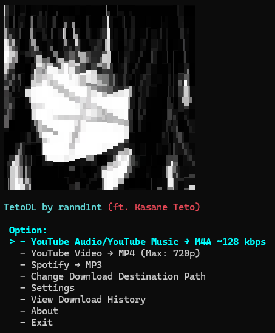
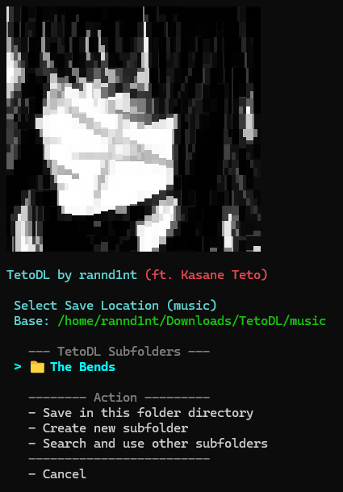
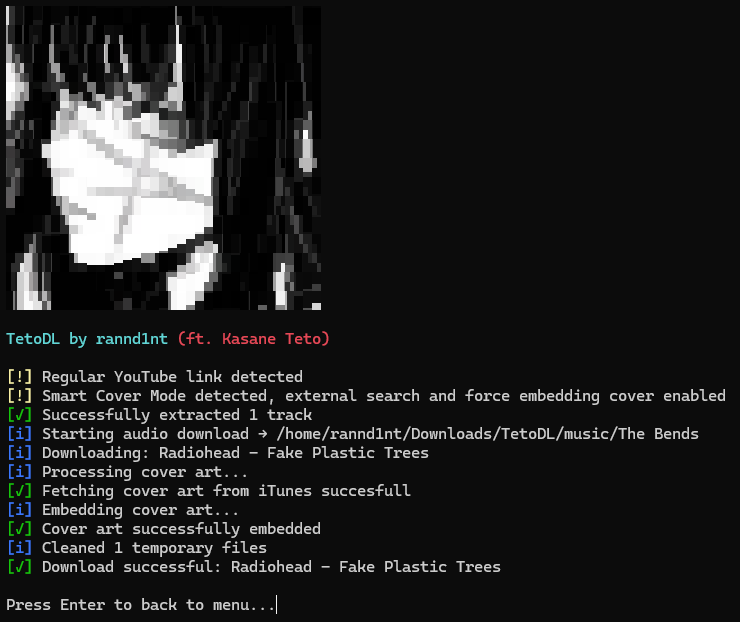
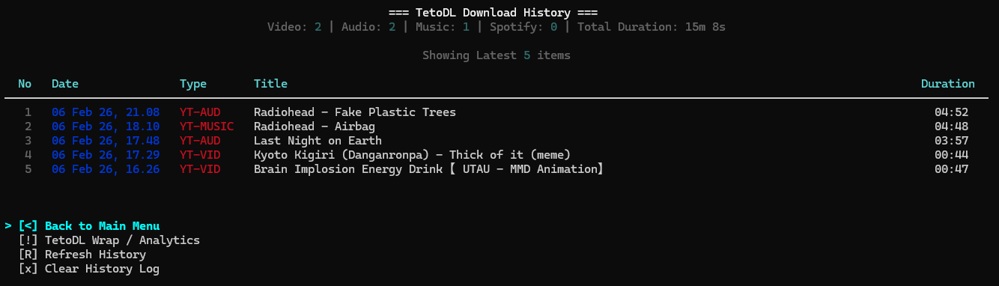
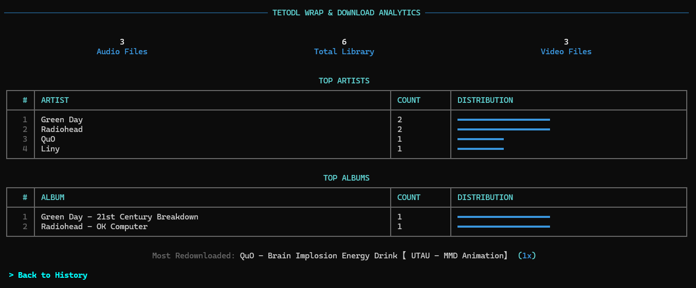

<div align="center">

  

  <h1>TetoDL - Hybrid CLI/TUI Media Suite</h1>

  <p>
    
    
    
  </p>
  
  <p>
    <a href="https://github.com/rannd1nt/TetoDL/issues">
      
    </a>
    
  </p>

</div>

**TetoDL** is a next-generation **Hybrid Media Suite** (CLI & TUI) engineered for Linux, WSL, and Android (Termux). It merges the raw power of command-line automation with the elegance of an interactive terminal interface.

Going beyond a simple downloader, TetoDL features a **Concurrent Async Engine** for high-speed playlists, a **3-Tier Smart Metadata** system (iTunes/Genius) for audiophile-grade tagging, and a built-in **Local Web Suite** to stream and share your library wirelessly via QR Code.

> **⚠️ NOTICE REGARDING SPOTIFY SUPPORT:** Due to ongoing restrictions with the **Spotify Developer Portal** (API access) and stability issues with upstream dependencies (`spotdl`), **TetoDL is currently focusing development on YouTube & YouTube Music**. Spotify features might be unstable or unavailable. We recommend using the `--lite` installation mode if you do not require Spotify functionality.

---

## Features

* **Hybrid Interface:** Seamlessly switch between a visual **TUI** for interactive navigation or simple usage and a powerful **CLI** for quick, scriptable downloads and advanced usage.
* **3-Tier Smart Metadata:** TetoDL goes beyond YouTube. It uses a cascade logic (iTunes API → Genius API → YouTube) to fetch HD Album Art, verbose metadata, and lyrics.
* **Async Engine:** Download playlists and albums at high speed using Concurrent Multi-threading. Includes intelligent rate-limiting and jitter to prevent IP bans.
* **Local Web Suite:** Turn your terminal into a modern file server. Share files to your phone via QR Code using a beautiful, dark-themed glassmorphism Web UI with built-in media streaming and downloading.
* **Playlist Ecosystem:** Automatically organizes downloads into **Groups** (subfolders), generates standard `.m3u8` playlists, and maintains order even during async downloads.
* **Smart Subfolder System:** Intelligently manages download paths. It remembers your created subfolders (e.g., for Albums/Playlists) and auto-cleans "ghost" folders from the menu if they are deleted from the disk.
* **TetoDL Analytics (Wrap):** visualize your download habits (Top Artists, Albums, Total Duration) directly in your terminal.
* **System Diagnostics:** Built-in tools to check system health, storage usage, and configuration.
* **Cross-Platform:** Optimized for **Linux & WSL**. (Legacy support for Termux available).

---

## Installation

### Prerequisites
* **Linux / WSL:** `git`, `python3`, `ffmpeg`
* **Termux:** `git`, `python`, `ffmpeg`

### Quick Install
Clone the repository and run the universal installer:

```bash
# 1. Clone Repository
git clone https://github.com/rannd1nt/TetoDL.git
cd TetoDL
```
```bash
# 2. Run Full Installer (Auto-detects OS & installs dependencies)
bash tetodl.sh
```
OR
```bash
# Without Spotdl Installation (Recommended)
bash tetodl.sh --lite
```

**Note for Termux Users:** The current `main` branch is optimized for Linux/WSL. <br>If you want the old stable version specifically designed for Android/Termux mobile interface, please use the legacy tag:
```bash
git clone --branch legacy-termux-v1 https://github.com/rannd1nt/TetoDL.git
```
---
## Command Reference

**1. Core Download & Quality**<br>
Basic flags to control what and how to download.

| Flag | Argument | Description |
|:-----|:-----|:-----|
| `-a`, `--audio` | - | Audio Mode. Download & convert to audio. |
| `-v`, `--video` | - | Video Mode. Download video (Default). |
| `--thumbnail-only` | - | Download Cover Art/Thumbnail only (No media file). |
|`--async`| - | Concurrent Mode. Download playlists using multi-threading.<br> This mode does not display detailed logs for each download process.|
|`--search`| QUERY | Search YouTube interactively. (Replaces URL argument). |
|`-l`, `--limit`| NUM | (Requires `--search`) Number of search results (Default: 5). |
| `-f`, `--format`| FORMAT | Force format: <br> **• Audio:** `mp3`, `m4a`, `opus` <br> **• Video:** `mp4`, `mkv` <br> **• Thumb**: `jpg`, `png`, `webp` |
|`-r`, `--resolution`| RES | Max video resolution limit: `480p`, `720p`, `1080p`, `2k`, `4k`, `8k`. |
| `-c`, `--codec` | CODEC | Set video codec: `default` (speed), `h264` (compat), `h265` (size).|
|`-o`, `--output`| PATH | Save to a custom output directory (Overrides TUI Base Path). |
|`--quiet`| - | Suppress process logs and progress hook |

**2. Metadata & Processing**<br>
Control FFmpeg slicing and the Smart Metadata engine.

| Flag | Argument | Description |
|:-----|:-----|:-----|
| `--cut` | TIME | Trim media. Formats:<br>• `Start-End`: Specific range (e.g. `1:30-2:00`).<br>• `Start-`: From timestamp to end (e.g. `1:30-`).<br>• `-End`: From beginning to timestamp (e.g. `-2:00`). |
|`--smart-cover`| - | **Force ON** Smart Cover (iTunes Search & Metadata) for this session. |
|`--lyrics` | - | Fetch & embed lyrics from Genius. |
| `--romaji` | - | Prioritize Romanized lyrics (e.g. for JP/KR songs). |
|`--no-cover`| - | **Force OFF** (Kill Switch). Disable all cover art, thumbnails, and metadata embedding. |
| `--force-crop` | - | Force crop YouTube thumbnail to 1:1 square if iTunes & Genius fails. Require `--smart-cover`.|

**3. Organization & Playlist**<br>
Manage folders, file selection, and archives.

| Flag | Argument | Description |
|:-----|:-----|:-----|
| `--group` | [NAME]| Save to a subfolder. If `NAME` is empty, uses Playlist/Album title. |
|`--m3u` | - | Generate `.m3u8` playlist file (Requires `--group`). |
| `--zip` | - | Archive the output into a `.zip` file. (Requires `--group` OR `--share-temp`). |
| `--items` |	LIST | Download specific indices (e.g., `--items 1,3,5-10`). |

**4. Network Sharing (Web Suite)**<br>
Host files via HTTP Server & QR Code.
| Flag | Argument | Description |
|:-----|:-----|:-----|
| `--share` | [PATH] | Staging/Local Mode. <br> • With URL: Downloads delta (missing files) to staging → Hosts → Merges to root. <br> • With Path: Hosts existing local folder.| 
| `--share-temp` | - | Volatile Mode. <br> Downloads to Temp → Hosts → Auto-Deletes on exit.


**5. Utility, Maintance & History**<br>
View statistics, logs, and manage the app.
| Flag | Argument | Description |
|:-----|:-----|:-----|
|`--info`| - | Show current configuration, system paths, and storage usage. |
|`--wrap`| - | Show TetoDL Analytics (Top Artists, Albums, & Total Duration). |
|`--history`| [LIMIT] | Show download history (default last 20). Ex: tetodl --history 50. |
|`--reverse`| - | **(Requires `--history`)** Show oldest downloads first. |
| `--find` |	QUERY |	**(Requires `--history`)** Filter history by title. (case-insensitive). |
|`--recheck`| - | Force dependency integrity check (ffmpeg, spotdl, etc). |
|`--reset`| TARGET | Reset data. Targets: `history`, `cache`, `config`, `registry`, `all`. |
|`--update`| - | Update TetoDL to latest version (Git Pull). |
|`--uninstall`| - | Remove TetoDL symlink, launcher, and cleanup user data. |

**6. Configuration**<br>
Advanced settings that are often hidden from the TUI.
| Flag | Argument | Description |
|:-----|:-----|:-----|
|`--header`| NAME |Set TUI app header (`default`, `classic` or `filename` in `assets/`). |
|`--progress-style`| STYLE | Set progress bar: `minimal`, `classic`, `modern`. |
| `--lang` | CODE | Set language: `en` (English) or `id` (Indonesia).|
| `--delay`| SEC | Set delay between downloads (seconds). |
| `--retries` | NUM | Set max download retries. |
| `--media-scanner` | on/off | Enable/Disable Android Media Scanner (Termux Only). |

---

## **CLI vs TUI Configuration**

1. **TUI (Interactive Mode - Persistent):**  
    Use the **TUI** to configure your **Global Defaults**. Any changes made here are saved permanently to `config.json` and will be used automatically for future downloads. This includes:
   - **Base Path:** Default download locations for Music and Video.
   - **Video Preferences:** Default Resolution (e.g., Max 
   1080p), Container (MP4/MKV), and Codec.
   - **Audio Preferences:** Default Quality/Format (M4A/MP3/Opus).
2. **CLI (Command Line - Runtime):**
   - **One-Time Overrides:** Flags like `-r 4k`, `-f mp3`, or `-o /tmp` only apply to the current command. They temporarily override your TUI defaults but do not change them permanently.
     and do not change global settings.
   - **Advanced Maintenance:** System-level settings like `--retries`, `--delay`, `--media-scanner` and `--reset` are exclusive to the CLI to prevent accidental changes in the TUI menu.

---

## TetoDL CLI Mode Usage
**TIP :** Always wrap URLs in quotes `'url'` to prevent shell errors with special characters like `&`.


### 1. Basic & High Performance

**Default Download (Auto-Detect)** <br>
Without any flags, TetoDL automatically detects the content type from the link. It relies on your saved configuration (defined in `config.json` or **TUI settings**) to determine the download path and quality preferences.
```bash
tetodl "https://youtu.be/track"
```

**High-Speed Playlist (Async)**<br>
Downloads a playlist using multi-threading (Safe limit: 3-5 threads) while maintaining the original playlist order for `--m3u`.
```bash
tetodl "https://youtube.be/playlist" -a --async
```

### 2. Audio Processing & Metadata
**Music Mode (M4A + Smart Metadata)**<br>
Forces audio conversion and activates the metadata engine.
```bash
tetodl "https://youtu.be/track" -a -f m4a --smart-cover --lyrics
```

What is `--smart-cover`?<br>
It uses a 3-Tier Logic to find the best metadata:
* **iTunes API :** Searches for official Album Art(HD) & Metadata.
* **Genius API :** Fetches Lyrics, Year, and fallback Cover Art if iTunes fails.
* **YouTube Fallback :** If both fail, uses the video thumbnail (Auto-cropped 1:1 if `--force-crop` is used).

### 3. Video & Asset Extraction
**Power User Video Mode:**<br>
Full control. Fetches high-quality video in **.mkv**, caps resolution at 1080p, forces h264 codec for compatibility, and saves to a custom path.
```bash
tetodl "https://youtu.be/track" -v -f mkv -r 1080p -c h264 -o "/home/user/Videos"
```

**Thumbnail Extraction:**<br>
Download the highest resolution cover art/thumbnail without the media file.
```bash
# Save youtube thumbnail as PNG
tetodl "https://youtu.be/track" --thumbnail-only -f png

# You can also use smart cover mode here to get music cover art
tetodl "https://youtu.be/track" --thumbnail-only --smart-cover -f jpg
```

### 4. Precision Editing (Cut & Raw)
**Trimming Media (Cut Mode):**<br>
Download only a specific part using FFmpeg slicing. Saves bandwidth.
```bash
# Download audio from minute 21:20 to 22:50
tetodl "https://youtu.be/track" -a --cut 21:20-22:50
```

**SFX / Raw Audio (No Metadata):**<br>
Ideal for video editors who need raw sound effects without embedded images/tags.

```bash
tetodl "https://youtu.be/track" -a --no-cover
```

### 5. Interactive Discovery
**Search Mode:**<br>
Don't have a URL? Use `--search` to find content directly from the terminal. This flag replaces the URL argument and works with all other flags.
```bash
# Basic Search (Default limit: 5)
tetodl --search "Never Gonna Give You Up"

# Advanced Search + Download Workflow
# Searches, selects, downloads as Audio, and fetches Full Metadata and Lyrics.
tetodl --search "Joji Sanctuary" -a -f m4a --smart-cover --lyrics
```

### 6. Organization (Groups)
**Playlist Management:**<br>
Downloads a playlist into a dedicated subfolder and generates an .m3u8 file for music players.

```bash
tetodl "https://youtu.be/playlist" -a --group "My Playlist" --m3u

# Groups without arguments will automatically name the subfolder using the playlist/album name.
tetodl "https://youtu.be/playlist" -a --group --m3u
```

### 7. Network Sharing
Turn your Desktop into a high-speed local file server. Access your media from any device on the same Wi-Fi via a Modern Web Interface or QR Code.
> **⚠️ WSL Warning:** This feature requires direct LAN access. It **will not work on WSL** (Windows Subsystem for Linux) due to network isolation logic, unless you configure "Mirrored Networking" manually.

**1. Local File Hosting (No Download)**<br>
Share existing files/folders from your library instantly.
- **Manual Path:**<br>
Host any specific directory on your system.
Bash
    ```bash
    tetodl --share "/home/user/Downloads/Music"
    ```
- **Root Shortcuts (`-a` / `-v`):**<br>
Host your configured Music Root or Video Root folder without typing the full path.

    ```bash
    # Hosts your entire Music Library
    tetodl --share -a
    ```
- **Smart Group Lookup:**<br>
Automatically finds a specific subfolder inside your Root Library.
    ```bash
    # Looks for "My Favorites" inside your Audio Root and hosts it.
    tetodl --share -a --group "My Favorites"
    ```
- **Local On-The-Fly Archiving (`--zip`):**<br>
Compresses a local group into a .zip file, hosts the zip, and auto-cleans (deletes) the zip file after the server stops.
Bash

    ```bash
    # 1. Zips "My Favorites" folder -> "My Favorites.zip"
    # 2. Hosts the Zip file.
    # 3. Deletes the Zip file upon exit (Folder remains safe).
    tetodl --share -a --group "My Favorites" --zip
    ```
**2. Download & Host (Remote Sharing)**<br>
Download content from YouTube and immediately share it.

- **Volatile Mode (`--share-temp`):**<br>
Downloads to a temporary folder (ignoring your existing library). Hosts the files, then permanently deletes them when the server stops.
    ```bash
    # Perfect for quick transfers without cluttering your storage.
    tetodl --search "Rust Programming Course for babies" -v --share-temp

    # Or use zip to make it easier to share playlists/albums
    tetodl "https://youtu.be/playlist" -a --share-temp --zip
    ```

- **Staging Share (`--share`):**<br>
Downloads only missing files to a staging folder, hosts them, then moves them to your library.
    - **Check:** Checks your root library. If a file exists, it is **skipped** (not downloaded).<br>
    - **Staging:** Downloads only missing files to a temporary folder named `[Title] (Share)`.
    - **Host:** Hosts only these new files.
    - **Merge:** On exit, moves files to your root library and deletes the staging folder.
    

    <br>

    ```bash
    tetodl "https://youtu.be/playlist" -a --share
    ```

- **Staging Archive (`--share` + `--zip`)**:<br>
Downloads to staging, zips it, deletes the staging folder, hosts the zip, and keeps the zip file in your library.
    ```bash
    # Result: You get a "Playlist.zip" in your library.
    tetodl "https://youtu.be/playlist" -a --share --zip
    ```

- **Collection Share (`--group --share`):**<br>
Ideal for maintaining a specific playlist folder and sharing the entire collection.
    - **Target:** Uses a subfolder (Group), create if none exists.
    - **Check:** Checks inside that specific group. If a file exists, it is skipped.
    - **Host:** Hosts the entire group folder (containing both old existing files + newly downloaded ones).
    - **Persist:** Files remain in the folder after exit.

    ```bash
    # Adds new songs to "My Favorites" and hosts the whole folder.
    tetodl "https://youtu.be/playlist" -a --group "My Favorites" --share
    ```

- **Collection Archive (`--group` + `--share` + `--zip`)**:<br>
Downloads to a group folder, creates a zip archive of the entire group, and hosts the zip.
    ```bash
    # Result: You keep both the "My Favorites" folder AND "My Favorites.zip".
    tetodl "https://youtu.be/playlist" -a --group "My Favorites" --share --zip
    ```

---

## TUI Mode Visual Tour
Experience the interactive menu by simply running `tetodl` without arguments.

### Main Menu Appearance


### Download Location Selection


### Download Progress Log


### Download History


### Download Wrap


---

## Localization (i18n)
TetoDL supports two languages:
- `en` — English
- `id` — Indonesian


## Acknowledgments
- Built on top [yt-dlp](https://github.com/yt-dlp/yt-dlp) and [ffmpeg](https://www.ffmpeg.org/)
- Inspired by various open-source downloader tools for YouTube and Spotify

## License
Distributed under the MIT License. See `LICENSE` for more information.