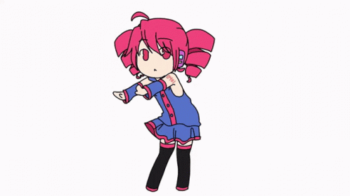

# TetoDL 🎧

**TetoDL** is a CLI tool for Termux that allows you to download **YouTube Audio/Video**, **YouTube Music**, and **Spotify**.  
Built on top of `yt-dlp` and `ffmpeg`, it offers flexible download options, including audio formats like `mp3`, `m4a`, or `opus`. For YouTube Music, it can embed cover art cropped to a square (1:1) except for opus format.

The tool also provides:

- Configurable root download folder and optional subfolder selection  
- Optional “Simple Mode” for fixed-directory output  
- Download history (latest 20 entries)  
- Metadata caching to speed up repeated downloads  
- Settings to clear cache/metadata or history  
- Built-in i18n (English `en` and Indonesian `id`)  
- Support for YouTube 720p / 1080p video downloads  

---

## 🚀 Features

- Download YouTube Video (720p / 1080p)
- Download YouTube Audio / YouTube Music
- Download Spotify tracks (if dependencies available)
- Configurable output directory + optional subfolder per download
- Simple Mode for quick downloads
- Download history & metadata cache
- Language support: English / Indonesian  
- Clean and user-friendly CLI interface

---

## 📥 Installation

> **Recommended installation**: Lite mode (no Spotify dependencies)

```bash
git clone https://github.com/rannd1nt/TetoDL.git
cd TetoDL
bash teto-dl.sh --lite
```
Full installation (YouTube + Spotify support):

```bash
bash teto-dl.sh
```
> ⚠️ Full installation might fail in environments missing Rust or required build tools for `spotdl`.

---

## ▶️ Usage
Run the tool using:
```bash
./main.py
```
On the first run, TetoDL will verify core dependencies:
- ffmpeg
- yt-dlp
- (optional) spotdl

---

## 🧰 Prerequisites

- Termux [(install from F-Droid)](https://f-droid.org/packages/com.termux/)
- Python 3.x
- `ffmpeg` and `yt-dlp` installed and accessible in PATH
- Optional: Rust toolchain + build requirements for full Spotify support

---

## ⚠️ Limitations
- Video downloads currently limited to 720p and 1080p
- Spotify downloads depend on the successful installation of `spotdl`
- Cover art embedding available only for YouTube Music

---

## 🌐 Localization (i18n)
TetoDL supports two languages:
- `en` — English
- `id` — Indonesian

---

## ✨ Acknowledgments
- Built on top [yt-dlp](https://github.com/yt-dlp/yt-dlp) and [ffmpeg](https://www.ffmpeg.org/)
- Inspired by various open-source downloader tools for YouTube and Spotify

