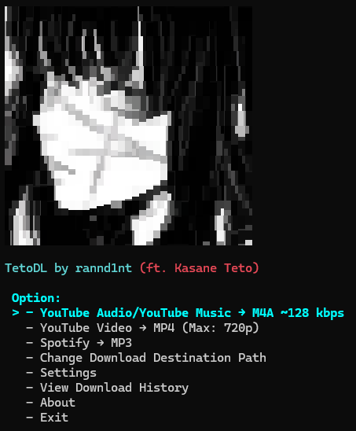
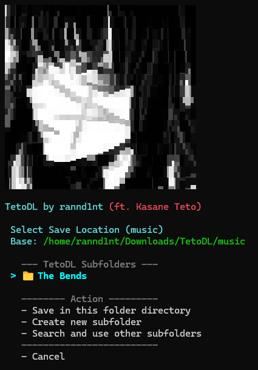
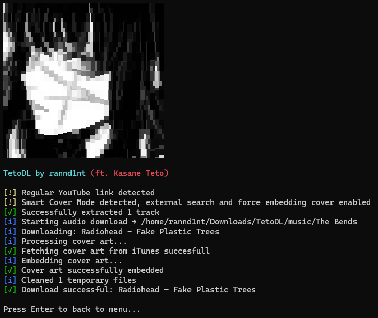
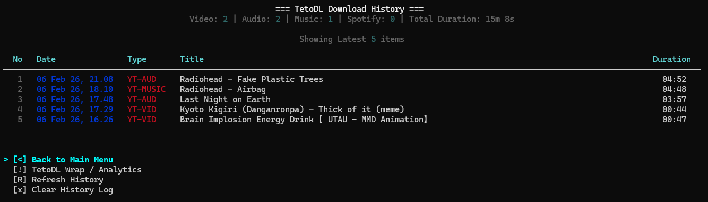
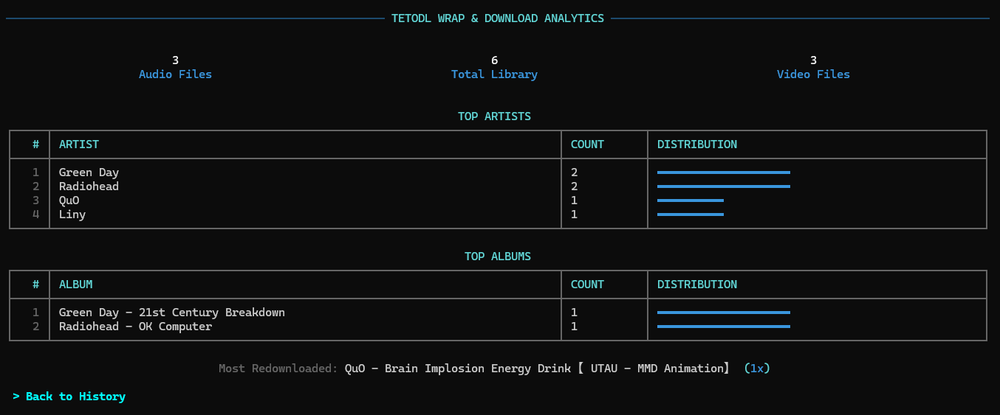

<div align="center">
  

  <h1>TetoDL</h1>
  <p><strong>Terminal & CLI Media Downloader and Local Streaming Suite</strong></p>

  <p>
    
    
    
    
  </p>
</div>

---

## Table of Contents

- [Overview](#overview)
- [Platform Support](#platform-support)
- [Installation](#installation)
  - [Pre-compiled Binary](#1-pre-compiled-binary-recommended)
  - [From Source / pip](#2-from-source--pip)
- [Synopsis](#synopsis)
- [CLI Reference](#cli-reference)
  - [1. Download Modes](#1-download-modes)
  - [2. Input Sources](#2-input-sources)
  - [3. Metadata & Tagging Modifiers](#3-metadata--tagging-modifiers)
  - [4. Output & Quality Controls](#4-output--quality-controls)
  - [5. Batch, Slicing & Archiving](#5-batch-slicing--archiving)
  - [6. Local Network Sharing & Web Server](#6-local-network-sharing--web-server)
  - [7. Service Management](#7-service-management-tetodl-service)
  - [8. Diagnostics & Maintenance](#8-diagnostics--maintenance)
  - [9. Persistent Configuration](#9-persistent-configuration)
- [Short Flag Bundling](#short-flag-bundling)
- [CLI Usage Examples](#cli-usage-examples)
- [Network Sharing Workflows](#network-sharing-workflows)
- [CLI vs TUI Configuration Precedence](#cli-vs-tui-configuration-precedence)
- [Interactive TUI Tour](#interactive-tui-tour)
- [Troubleshooting & Debugging](#troubleshooting--debugging)
- [License](#license)

---

## Overview

**TetoDL** is a dual-interface media downloader and streaming tool designed for **Linux** and **Windows**. It operates either as an interactive terminal UI (TUI) or as a non-interactive, scriptable command-line tool (CLI).

Under the hood, TetoDL coordinates `yt-dlp` and `ffmpeg` to download and convert streams from YouTube, YouTube Music, and Spotify (tracks, albums, playlists, and shortlinks). It incorporates a multi-tier metadata resolution cascade (iTunes API → Genius API → YouTube Music) for tag and cover embedding, an asynchronous worker pool for concurrent playlist ingestion, and an embedded HTTP daemon for local network streaming and file distribution via QR code.

---

## Platform Support

| Platform | Architecture | Daemon Integration | Packaging |
|:---|:---|:---|:---|
| **Linux** | x86_64, aarch64 | `systemd --user` | Standalone ELF binary / Python package |
| **Windows** | x64 | Windows Task Scheduler | Standalone PE executable / Python package |

---

## Installation

### 1. Pre-compiled Binary (Recommended)

Standalone binaries bundle Python and FFmpeg. No system prerequisites required.

#### Linux
```bash
curl -fsSL "https://rannd1nt.github.io/TetoDL/install.sh" | bash
```
Installs the executable to `~/.local/bin/tetodl` and configures `$PATH`.

#### Windows (PowerShell)
```powershell
iwr "https://rannd1nt.github.io/TetoDL/install.ps1" | iex
```
Installs `tetodl.exe` and `ffmpeg.exe` to `%LOCALAPPDATA%\TetoDL` and updates User `PATH`.

---

### 2. From Source / pip

Requirements: Python 3.10+ and system `ffmpeg`.

```bash
git clone https://github.com/rannd1nt/TetoDL.git
cd TetoDL
pip install .
```

---

## Synopsis

```text
tetodl [OPTIONS] [URL]
tetodl [OPTIONS] -S QUERY
tetodl [OPTIONS] -s [PATH]
tetodl service serve [OPTIONS]
tetodl service daemon {setup,remove,status,logs,display} [OPTIONS]
tetodl debug {all,errors,concise} [OPTIONS...]
```

Running `tetodl` without arguments starts the interactive TUI.

---

## CLI Reference

### 1. Download Modes

Modes are mutually exclusive. Choosing more than one raises a validation error.

| Flag | Long Option | Description |
|:---|:---|:---|
| `-A` | `--audio` | Force audio mode. Converts stream to `m4a`, `mp3`, or `opus`. Automatically inferred for YouTube Music and Spotify sources. |
| `-V` | `--video` | Force video mode (default for standard YouTube URLs). Incompatible with Spotify sources. |
| `-T` | `--thumbnail` | Download album art or video thumbnail only. Does not download audio or video. Incompatible with `--cut`, `--resolution`, and `--codec`. |

---

### 2. Input Sources

| Flag | Long Option | Argument | Description |
|:---|:---|:---|:---|
| | `URL` | `[string]` | Media URL (YouTube video/playlist, YouTube Music track/album, Spotify track/album/playlist/shortlink). |
| `-S` | `--search` | `QUERY` | Search YouTube interactively. Prompts for selection before downloading. Replaces the `URL` argument. |
| | `--limit` | `NUM` | Number of search results returned (default: `5`). Requires `-S`/`--search`. |

---

### 3. Metadata & Tagging Modifiers

| Flag | Long Option | Description |
|:---|:---|:---|
| `-c` | `--cover` | Fetch and embed high-resolution album cover art. Auto-enabled for YouTube Music and Spotify. |
| `-m` | `--metadata` | Fetch and embed ID3/MP4 metadata tags (Title, Artist, Album, Year, Genre) via iTunes/Genius/YTM cascade. Auto-enabled for YouTube Music and Spotify. |
| `-l` | `--lyrics` | Fetch and embed synchronized or plain lyrics from Genius. |
| | `--romaji` | Prioritize romanized lyrics for non-Latin releases (JP/KR). Requires `-l`/`--lyrics`. |
| `-N` | `--no-enrich` | Disable all enrichment. Strips all embedded tags, cover art, and lyrics. Overrides auto-enrichment on YouTube Music and Spotify. Incompatible with `-c`, `-m`, or `-l`. |

---

### 4. Output & Quality Controls

| Flag | Long Option | Argument | Description |
|:---|:---|:---|:---|
| `-f` | `--format` | `FORMAT` | Target file container:<br>• **Audio:** `mp3` (~192 kbps), `m4a` (~128 kbps AAC), `opus` (~160-180 kbps)<br>• **Video:** `mp4`, `mkv`<br>• **Thumbnail:** `jpg`, `png`, `webp` |
| `-r` | `--resolution`| `RES` | Video resolution ceiling: `144p`, `240p`, `360p`, `480p`, `720p`, `1080p`, `2k` (1440p), `4k` (2160p), `8k` (4320p). Ignored in audio mode. |
| | `--codec` | `CODEC` | Video codec priority: `default` (fastest download/mux), `h264` (broad compatibility), `h265` (smaller file size). |
| `-o` | `--output` | `PATH` | Custom output directory path. Overrides default configured paths. Directory is created automatically if missing. |
| `-q` | `--quiet` | - | Suppress standard download logging and progress hook output. |

---

### 5. Batch, Slicing & Archiving

| Flag | Long Option | Argument | Description |
|:---|:---|:---|:---|
| `-a` | `--async` | - | Enable concurrent multi-threaded worker pool for playlists/albums with jitter and rate-limiting. Preserves playlist order. |
| | `--items` | `LIST` | Download specific indices from a playlist (e.g. `--items 1,3,5-10`, `--items 10-`, `--items -5`). |
| | `--cut` | `TIME` | Slice media with FFmpeg without full redownload. Syntax:<br>• `START-END`: e.g. `01:30-02:00` or `90-120`<br>• `START-`: from offset to end (e.g. `01:30-`)<br>• `-END`: from beginning to offset (e.g. `-02:00`) |
| `-g` | `--group` | `[NAME]` | Store downloads in a dedicated subfolder. If `NAME` is omitted, names the folder after the playlist/album title. |
| | `--m3u` | - | Generate standard `.m3u8` playlist index in the target folder. Requires `-g`/`--group`. |
| `-z` | `--zip` | - | Package the completed output folder into a `.zip` archive. |

---

### 6. Local Network Sharing & Web Server

Hosts downloaded media or existing local directories over HTTP with an integrated web UI and terminal QR code.

| Flag | Long Option | Argument | Description |
|:---|:---|:---|:---|
| `-s` | `--share` | `[PATH]` | Launch local HTTP server. When `PATH` is provided, hosts local directory. When omitted with `URL`, downloads and serves media. When omitted without `URL`, serves the last completed download. |
| `-t` | `--temp` | - | Volatile session. Downloads to temporary directory, serves over HTTP, and purges all files upon server termination. Requires `-s`/`--share`. |

---

### 7. Service Management (`tetodl service`)

Manage the background web orchestrator and API daemon.

#### Foreground Web Server
```bash
tetodl service serve [OPTIONS]
```
| Option | Argument | Description |
|:---|:---|:---|
| `--host` | `IP` | Bind address (default: `0.0.0.0`). |
| `-p`, `--port` | `PORT` | Bind port (default: `7370`). |
| `-v`, `--verbose`| - | Enable request logging. |
| `-q`, `--quiet` | - | Suppress startup banner and QR code output. |
| `--dev` | - | Run with auto-reload enabled (development mode). |
| `--log-file` | `FILE` | Redirect or tee server logs to file. |

#### Background Daemon Control
```bash
tetodl service daemon {setup,remove,status,logs,display} [OPTIONS]
```
| Subcommand | Options | Description |
|:---|:---|:---|
| `setup` | `[--host H] [-p P]` | Install and start background daemon (`systemd --user` on Linux, Task Scheduler on Windows). |
| `remove` | - | Stop and uninstall background daemon service. |
| `status` | - | Print current daemon status, process PID, and bind address. |
| `logs` | `[-n LINES] [-f]` | Display daemon logs. `-n` sets tail limit (default: 50), `-f` follows output. |
| `display` | - | Display current LAN access URL and terminal QR code for the running daemon. |

---

### 8. Diagnostics & Maintenance

| Flag | Argument | Description |
|:---|:---|:---|
| `--info` | - | Print system diagnostics, storage usage, cache statistics, and tool paths. |
| `--wrap` | - | Display TetoDL Analytics report (top artists, top albums, total playback time, file counts). |
| `--history` | `[LIMIT]` | Print download history (default: last 20 entries). |
| `--reverse` | - | Invert history order (oldest first). Requires `--history`. |
| `--find` | `QUERY` | Filter history records by search term. Requires `--history`. |
| `--recheck` | - | Force dependency verification (`ffmpeg`, `yt-dlp`). |
| `--reset` | `TARGET...` | Reset application state. Valid targets: `history`, `cache`, `config`, `registry`, `all`. |
| `--update` | - | Pull and apply the latest release from GitHub. |
| `--uninstall` | - | Remove binary installation, unregister PATH entries, and purge local config. |

---

### 9. Persistent Configuration

Configuration flags write changes permanently to `config.json`:

| Flag | Argument | Description |
|:---|:---|:---|
| `--header` | `NAME` | Set TUI header style (`default`, `classic`, or custom ASCII file in `assets/`). |
| `--progress-style`| `STYLE` | Set terminal progress bar: `minimal`, `classic`, or `modern`. |
| `--lang` | `CODE` | Set application language: `en` (English) or `id` (Indonesian). |
| `--jitter` | `MIN-MAX` | Set delay range in seconds between playlist downloads (e.g. `--jitter 3-5`). |
| `--retries` | `NUM` | Set maximum retry attempts on transient download errors. |

---

## Short Flag Bundling

TetoDL supports standard POSIX short flag bundling alongside smart preprocessor expansion for optional-argument flags:

### Standard Bundling
Multiple single-letter boolean flags can be combined into a single token:
```bash
# -A (audio) + -m (metadata) + -c (cover) + -l (lyrics)
tetodl "https://youtu.be/track" -Amcl

# -V (video) + -q (quiet)
tetodl "https://youtu.be/track" -Vq
```

### Combinable Share Bundles
Flags `-s` (share) and `-g` (group) take optional arguments. The CLI preprocessor decomposes trailing combinable characters (`t`, `z`, `g`, `a`) automatically:
```bash
# Expands to: -s -t -z (share + temp + zip)
tetodl "https://youtu.be/track" -A -stz

# Expands to: -a -s -t -z (async + share + temp + zip)
tetodl "https://youtu.be/playlist" -A -astz

# Expands to: -s -z (share + zip)
tetodl -s -A -g "Rock" -sz
```

---

## CLI Usage Examples

### Audio Downloads with Metadata
```bash
# Download track as M4A with full tags and cover art
tetodl "https://youtu.be/track" -A -f m4a -c -m

# Download track with Genius lyrics and prioritize romanized text
tetodl "https://youtu.be/track" -A -c -m -l --romaji

# Strip all metadata tags for raw audio / sound effect assets
tetodl "https://youtu.be/sfx" -A -N -f mp3
```

### High-Speed Playlist Ingestion
```bash
# Concurrently download playlist tracks into a named folder and build .m3u8 index
tetodl "https://youtu.be/playlist" -A -a -g "Synthwave" --m3u

# Download specific index ranges from a playlist
tetodl "https://youtu.be/playlist" -A --items 1,3,5-10
```

### Video Quality Ceiling & Codec Selection
```bash
# Download 1080p video in MKV container forced to H.264 codec
tetodl "https://youtu.be/video" -V -f mkv -r 1080p --codec h264 -o ~/Videos
```

### FFmpeg Trimming (Slice Download)
```bash
# Download audio slice between 01:30 and 02:45 without downloading full file
tetodl "https://youtu.be/track" -A --cut 01:30-02:45
```

### Standalone Thumbnail Extraction
```bash
# Extract high-resolution cover artwork as PNG
tetodl "https://youtu.be/track" -T -f png
```

### Interactive YouTube Search
```bash
# Search for query, select track interactively, and download as M4A
tetodl -S "Reol No title" -A -f m4a -c -m
```

---

## Network Sharing Workflows

The `-s/--share` flag turns your workstation into a local HTTP media streaming and download endpoint.

### 1. Download & Host (Remote Staging)

#### Volatile Share (`-s -t` / `-stz`)
Downloads media into a temporary sandbox, launches the server, and purges all files when terminated (`Ctrl+C`):
```bash
# Download, zip, serve via QR code, then automatically wipe files on exit
tetodl "https://youtu.be/playlist" -A -astz
```

#### Staging Share (`-s`)
Downloads missing delta tracks to a temporary folder, serves them to LAN clients, and merges them into your root library upon shutdown:
```bash
tetodl "https://youtu.be/playlist" -A -a -s
```

#### Collection Share (`-g [NAME] -s`)
Downloads into a group folder and serves the entire folder:
```bash
tetodl "https://youtu.be/playlist" -A -a -g "Favorites" -s
```

---

### 2. Standalone File Hosting (No Download)

Host existing directories from your filesystem without invoking download engines:

```bash
# Host explicit path
tetodl -s /home/user/Music/Albums

# Host configured Music Root directory
tetodl -s -A

# Locate and host subfolder inside configured Music Root
tetodl -s -A -g "Vocaloid"

# Compress folder on-the-fly, serve ZIP archive, and clean up temporary zip on exit
tetodl -s -A -g "Vocaloid" -z

# Host the most recent download recorded in history
tetodl -s
```

---

## CLI vs TUI Configuration Precedence

1. **Global Defaults (`config.json` via TUI):**  
   Settings chosen in the TUI (Base paths, preferred video resolution, default container, audio codec) persist across all sessions in `config.json`.
2. **Runtime Overrides (CLI Arguments):**  
   Flags supplied on the command line (e.g. `-r 1080p`, `-f m4a`, `-o /path`) temporarily override configuration values for that specific process without mutating `config.json`.
3. **Explicit Config Modification (CLI System Flags):**  
   Flags like `--header`, `--progress-style`, `--lang`, `--jitter`, and `--retries` directly modify and persist settings to `config.json`.

---

## Interactive TUI Tour

Launch `tetodl` with no arguments to enter the terminal interface.

### Main Menu


### Download Location Selection


### Real-Time Download Progress


### Download Transaction History


### TetoDL Analytics (Wrap)


---

## Troubleshooting & Debugging

### Diagnostic Overview
Inspect configuration paths, environment integrity, and storage consumption:
```bash
tetodl --info
```

### Trace Execution
Run any command under the built-in execution tracer to capture debugging logs:
```bash
# Capture full trace
tetodl debug all "https://youtu.be/track" -A

# Trace exceptions and errors only
tetodl debug errors "https://youtu.be/track" -A

# Trace function entries and exits
tetodl debug concise "https://youtu.be/track" -A
```
Trace logs are stored in the current working directory with the prefix `tetodl_trace_*.log`.

### Application State Reset
Purge cached responses, download history, or configuration files:
```bash
tetodl --reset cache history
tetodl --reset all
```

---

## License

Distributed under the MIT License. See [LICENSE](LICENSE) for details.
